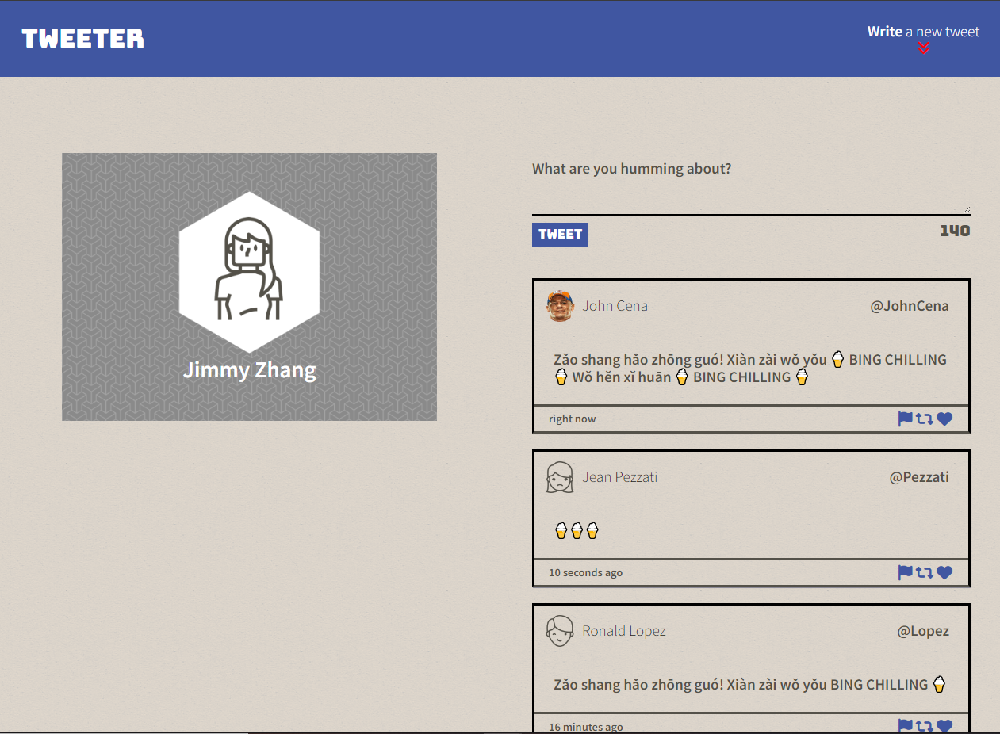
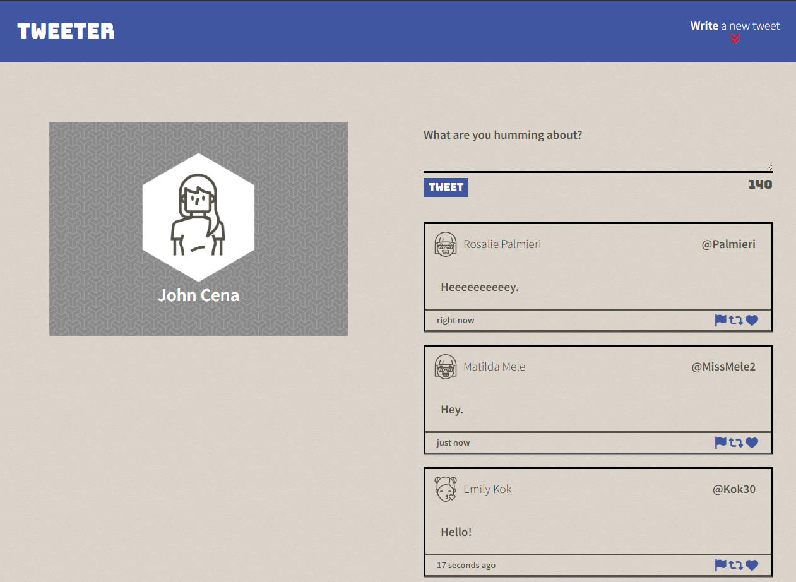
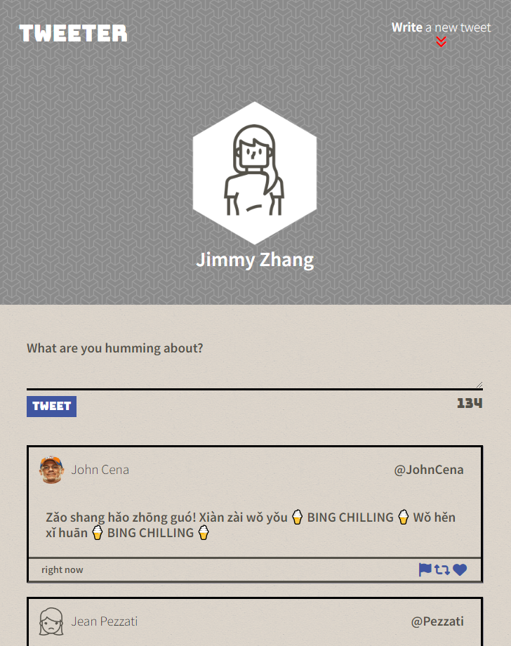
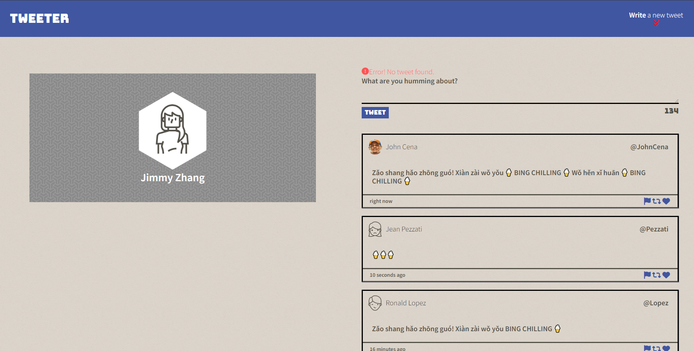
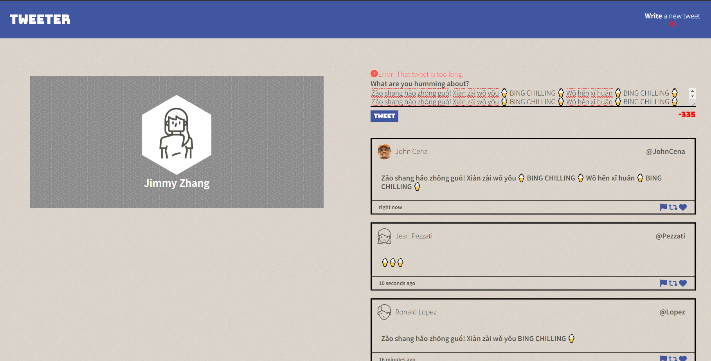

# Tweeter Project

Tweeter is a simple, single-page Twitter clone. In this project, we showcased our knowledge of HTML, CSS, JS, jQuery and AJAX front-end skills, as well as our Node and Express back-end skills.

## Screenshots

Here is how it turned out!

When we post a tweet, it gives us a random username, along with a random name and avatar. We make use of the timeago jQuery plugin to support time stamps that are updated automatically.

When resized to a width of under 1024px, our page adjusts to a cleaner look, thanks to our usage of media queries.

When we try to post a tweet without any text, we get a nice error message that is animated with a slide effect.

This also happens when our tweet is above 140 characters, just like actual Twitter!

## Getting Started

1. [Create](https://docs.github.com/en/repositories/creating-and-managing-repositories/creating-a-repository-from-a-template) a new repository using this repository as a template.
2. Clone your repository onto your local device.
3. Install dependencies using the `npm install` command.
4. Start the web server using the `npm start` command. The app will be served at <http://localhost:8080/>.
5. Go to <http://localhost:8080/> in your browser.

## Dependencies

- Express
- Node 5.10.x or above
